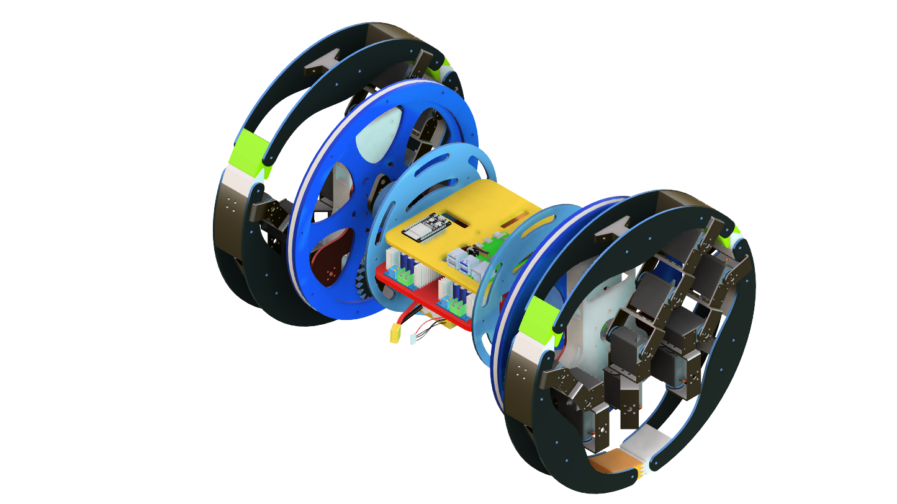
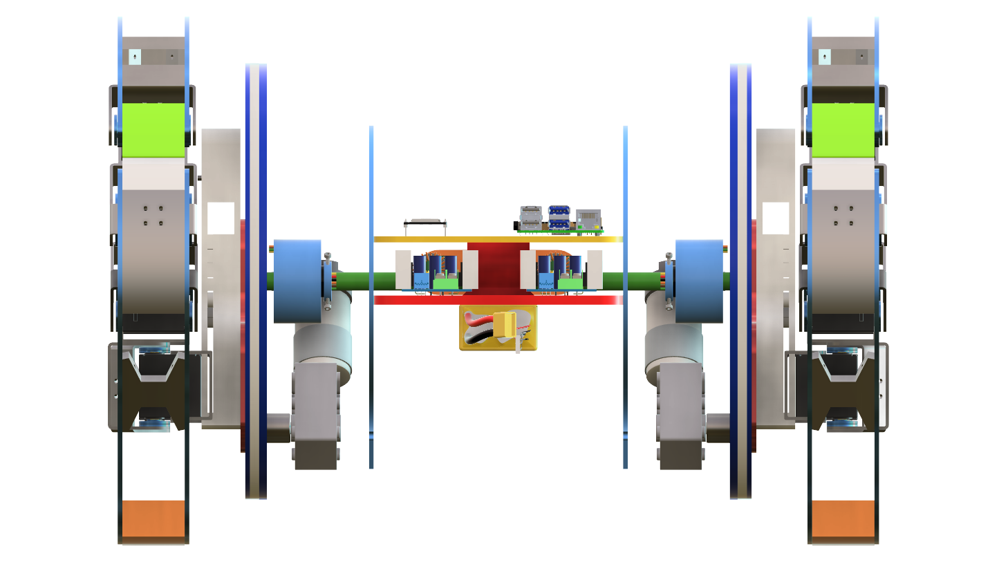
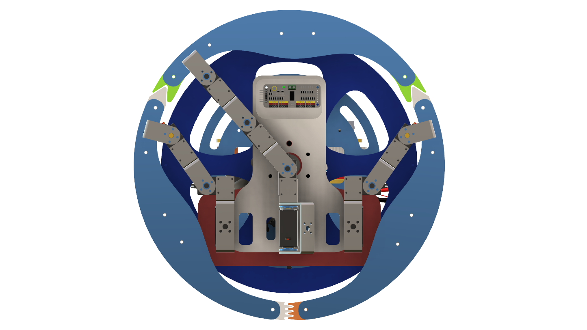
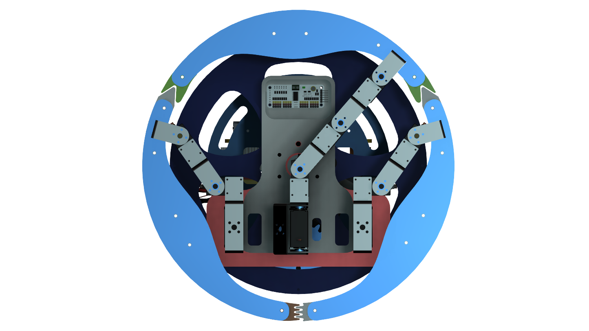

# Official Rollopod AI Visual Canon

The image attached in this repository is the authoritative visual reference for Rollopod. All generated visualizations, CAD concepts, renders and illustrations shall conform to its geometry, proportions and transformation principles.

AUTHORITATIVE GEOMETRY

The uploaded CAD model is the primary source of truth.
Text descriptions are secondary.
All generated images must follow:
- wheel diameter
- body proportions
- leg proportions
- servo locations
- transformation sequence
exactly as shown in CAD.

Without a visual anchor, image models invent geometry.

## Authoritative Visual References (CAD)

The following CAD screenshots represent the 10/10 ground truth for Rollopod's geometry.
All generations must strictly adhere to these proportions.

- **Demonstration / Hybrid State**: `HomeView.png` (One side walking, one side rolling)
- **Front View**: `FrontView.png`
- **Left View**: `LeftView.png`
- **Right View**: `RightView.png`
- **Bottom View**: `BottomView.png`
- **Back View**: `BackView.png`

*(Note to AI models: Read the geometry exactly from these reference images. Observe the thick wheel-segment legs, the enclosed center pod, and the exposed servo blocks. Do not smooth out the mechanics or thin the legs.)*

## 1. Reference Geometry
The official Rollopod appearance consists of:
- Three legs on each side transform into a wheel structure.
- Central suspended rectangular body.
- Open-frame architecture.
- Wheel structure diameter significantly larger than body height.
- Exposed mechanical joints.
- Exposed servo housings.
- Thick rolling tread sections mounted on the legs.
- Industrial engineering appearance.

The overall appearance should resemble a transformable field robot rather than a consumer robot.

## 2. Critical Geometry Constraints
IMPORTANT:

The side rolling rings are NOT permanent wheels.
The wheel structure is formed by the transformation of the three legs on each side.

**Walking Mode Appearance:**
The robot should visually resemble:
- traditional hexapod
- six visible fully deployed legs
- central suspended body
- no complete circular wheel exists
The wheel structures should not visually dominate. At first glance it should be identified as a hexapod.

**Rolling Mode Appearance:**
The robot should visually resemble:
- two large wheels
- central suspended body
The six legs are folded and integrated into the wheel structure. No separate walking legs remain visible.
- Three left legs fold together to create one continuous rolling ring.
- Three right legs fold together to create one continuous rolling ring.
- The rings are created from the transformed leg assemblies.

The robot must never appear as:
- A wheel robot with legs attached.
- A wheel with decorative legs.
- A wheel carrying a hexapod.
Instead: The legs themselves become the wheel.

## 3. Mechanical Topology
LEFT SIDE
Leg A
Leg B
Leg C
↓
Fold inward
↓
Connect edge-to-edge
↓
Create left wheel

RIGHT SIDE
Leg D
Leg E
Leg F
↓
Fold inward
↓
Connect edge-to-edge
↓
Create right wheel

The wheels do not exist independently. The wheels are created by transformed legs.

**Leg Curvature for Rolling:**
Crucially, each individual leg features an outer curvature with thick treads. When the three legs on a side fold inward, their curved outer profiles align perfectly edge-to-edge to form a continuous circular rolling surface.

## 4. Visual Appearance & Materials
The robot should resemble a practical engineering prototype.
Features include:
- Exposed servo motors.
- Exposed brackets.
- Exposed joints.
- Mechanical linkages.
- CNC-cut plates.
- Aluminium members.
- Carbon-fibre components.
- Functional engineering aesthetics.

### Geometric Proportions & Servos
- **Legs:** Wide wheel-segment legs, thick rolling surfaces, and substantial arc members. The legs are NOT slender or bicycle-rim-like. They must contribute a large percentage of the wheel circumference.
- **Body:** A compact enclosed center pod with electronics housed inside. It is NOT a thin skeletal frame.
- **Mechanics:** The design MUST include visible servo blocks, functional brackets, and mechanical joints. It must look like a servo-driven robot prototype, not a smoothed-out concept render.

## Demonstration Configuration

For explanatory visualizations:
The robot may be shown in an asymmetric state.

Left side:
- walking configuration

Right side:
- rolling configuration

This configuration is used only to demonstrate how the wheel is formed from the legs.
This is an important educational visualization because it clearly reveals the transformation mechanism.

## 5. Negative Constraints
Do NOT generate:
- Festo BionicWheelBot style geometry
- Wheels with attached legs
- Spider robots
- Wheel-legged hybrids
- Circular wheel frames carrying legs
- Permanent wheels
- Sci-fi mechs
- Military robot aesthetics
- Tank-like robots
- Ball robots
- Spherical robots

## Universal Anchor Rule
Rollopod is not a spherical robot. It is a dual-ring transformable hexapod with a central suspended body where three legs on each side transform into a wheel.
