# Rollopod Mechanical Structure & Coaxial Axle Topology

This document details the authoritative mechanical structure, mass distribution, and visual representation of the **Rollopod** transformable hexapod robot.

---

## 1. Linear Coaxial Axle Topology

The entire Rollopod mechanical structure is arranged along a **single continuous coaxial axle**. Unlike hierarchical or stacked tree designs, all drive motors, side disks, transforming leg wheels, and the central body pod are mechanically aligned along one primary horizontal axis.

```
<------------------ LEFT ASSEMBLY (5 kg) ------------------>   <-- CENTRAL POD (1 kg) -->   <------------------ RIGHT ASSEMBLY (5 kg) ------------------>
[ LSW ]  ===  [ LSD ]  ===  [ LM ]  -- ( LMS ) -- [ ROD_START ] ======= [ MID ] ======= [ ROD_END ] -- ( RMS ) -- [ RM ]  ===  [ RSD ]  ===  [ RSW ]
```

### Component Legend & Mass Specifications

| Symbol | Component Name | Description / Specifications | Mass / Sub-Assembly |
| :--- | :--- | :--- | :--- |
| **LSW** | Left Side Wheel | Transformed outer wheel formed by 3-leg servo assembly (Left). | Combined **5.0 kg**<br/>*(LSW + LSD + LM)* |
| **LSD** | Left Side Disk | Mounting and structural guide disk attached to the left wheel assembly. | |
| **LM** | Left DC Motor | Primary drive motor (100 RPM, 25 kg·cm high torque). | |
| **LMS** | Left Motor Shaft | Mechanical output shaft of the left DC motor. | Axle Coupling |
| **ROD_START** | Central Shaft Rod (Left Start) | Left mounting point connecting the motor shaft to the central pod axle rod. | Axle Coupling |
| **MID** | Central Pod | Suspended central body housing ESP32 controllers, IMU, PWM drivers, & battery. | **1.0 kg** |
| **ROD_END** | Central Shaft Rod (Right End) | Right mounting point connecting the central pod axle rod to the right motor shaft. | Axle Coupling |
| **RMS** | Right Motor Shaft | Mechanical output shaft of the right DC motor. | Axle Coupling |
| **RM** | Right DC Motor | Primary drive motor (100 RPM, 25 kg·cm high torque). | Combined **5.0 kg**<br/>*(RSW + RSD + RM)* |
| **RSD** | Right Side Disk | Mounting and structural guide disk attached to the right wheel assembly. | |
| **RSW** | Right Side Wheel | Transformed outer wheel formed by 3-leg servo assembly (Right). | |
| **TOTAL** | **Entire Robot** | **Total Operational Mass of Rollopod Structure** | **11.0 kg Total** |

---

## 2. Graphical Representation (ASCII Block Diagram)

```
===================================================================================================================================
                                      ROLLOPOD COAXIAL MECHANICAL ASSEMBLY (TOTAL MASS: 11 kg)
===================================================================================================================================

       LEFT SIDE WHEEL ASSEMBLY              LEFT DRIVE ENGINE                 CENTRAL AXLE POD FRAME               RIGHT DRIVE ENGINE            RIGHT SIDE WHEEL ASSEMBLY
      [ Mass: 5.0 kg Total ]                                                  [ Mass: 1.0 kg Total ]                                                  [ Mass: 5.0 kg Total ]
  +--------------------------------+      +---------------------+      +-----------------------------------+      +---------------------+      +--------------------------------+
  |                                |      |                     |      |                                   |      |                     |      |                                |
  |   +------------------------+   |      |   +-------------+   |      |   +---------------------------+   |      |   +-------------+   |      |   +------------------------+   |
  |   |          LSW           |   |      |   |     LM      |   |      |   |            MID            |   |      |   |     RM      |   |      |   |          RSW           |   |
  |   |    Left Side Wheel     |   |      |   |  DC Motor   |   |      |   |        Central Pod        |   |      |   |  DC Motor   |   |      |   |    Right Side Wheel    |   |
  |   |  (3x Servo Leg Wheel)  |===|======|===| 100RPM/25kgcm|===|======|===|  (ESP32, Battery, IMU)    |===|======|===| 100RPM/25kgcm|===|======|===|  (3x Servo Leg Wheel)  |   |
  |   +-----------+------------+   |      |   +------+------+   |      |   +-------------+-------------+   |      |   +------+------+   |      |   +-----------+------------+   |
  |               |                |      |          |          |      |                 |                 |      |          |          |      |               |                |
  |               v                |      |       ( LMS )       |      |                 v                 |      |       ( RMS )       |      |               v                |
  |   +------------------------+   |      |   Left Motor Shaft  |      |         Central Axle Rod          |      |  Right Motor Shaft  |      |   +------------------------+   |
  |   |          LSD           |   |      +----------+----------+      |   +---------------------------+   |      +----------+----------+      |   |          RSD           |   |
  |   |     Left Side Disk     |===|=================|=================|===| [ROD_START] --- [ROD_END] |===|=================|=================|===|    Right Side Disk     |   |
  |   +------------------------+   |                                   |   +---------------------------+   |                                   |   +------------------------+   |
  |                                |                                   |                                   |                                   |                                |
  +--------------------------------+                                   +-----------------------------------+                                   +--------------------------------+
  \________________________________/                                                                                                           \________________________________/
     Left Transforming Assembly (5kg)                                                                                                             Right Transforming Assembly (5kg)

  <=================================================================== SINGLE COAXIAL AXLE ===================================================================>
```

---

## 3. Interactive Structural Diagram (Mermaid)

```mermaid
graph LR
    subgraph Left_Assembly ["Left Assembly (5 kg Total)"]
        LSW["<b>LSW</b><br/>Left Side Wheel<br/><i>(3 Servo-Leg Formation)</i>"]
        LSD["<b>LSD</b><br/>Left Side Disk"]
        LM["<b>LM</b><br/>Left DC Motor<br/><i>(100 RPM / 25 kg·cm)</i>"]
    end

    subgraph Left_Drive ["Left Shaft Coupling"]
        LMS("<b>LMS</b><br/>Left Motor Shaft")
    end

    subgraph Central_Core ["Central Axle & Pod (1 kg)"]
        ROD_START["<b>ROD_START</b><br/>Shaft Rod Start"]
        MID["<b>MID</b><br/>Central Pod (1 kg)<br/><i>(Control, IMU, Battery)</i>"]
        ROD_END["<b>ROD_END</b><br/>Shaft Rod End"]
    end

    subgraph Right_Drive ["Right Shaft Coupling"]
        RMS("<b>RMS</b><br/>Right Motor Shaft")
    end

    subgraph Right_Assembly ["Right Assembly (5 kg Total)"]
        RM["<b>RM</b><br/>Right DC Motor<br/><i>(100 RPM / 25 kg·cm)</i>"]
        RSD["<b>RSD</b><br/>Right Side Disk"]
        RSW["<b>RSW</b><br/>Right Side Wheel<br/><i>(3 Servo-Leg Formation)</i>"]
    end

    %% Coaxial Axis Connections
    LSW === LSD
    LSD === LM
    LM === LMS
    LMS === ROD_START
    ROD_START === MID
    MID === ROD_END
    ROD_END === RMS
    RMS === RM
    RM === RSD
    RSD === RSW

    %% Visual Styling
    style Central_Core fill:#1f2937,stroke:#3b82f6,stroke-width:2px,color:#fff
    style Left_Assembly fill:#111827,stroke:#10b981,stroke-width:2px,color:#fff
    style Right_Assembly fill:#111827,stroke:#10b981,stroke-width:2px,color:#fff
    style Left_Drive fill:#1f2937,stroke:#f59e0b,stroke-width:2px,color:#fff
    style Right_Drive fill:#1f2937,stroke:#f59e0b,stroke-width:2px,color:#fff
```



---

## 4. Mass Distribution & Physical Dynamics

The **11 kg total mass** is distributed symmetrically around the central pod axis:

```
  Left Wheel Assembly (5 kg) <------ 1 kg Central Pod ------> Right Wheel Assembly (5 kg)
  [==== 45.45% Mass ====]           [== 9.1% Mass ==]           [==== 45.45% Mass ====]
```

1. **Left Side Assembly (`LSW + LSD + LM`) = 5.0 kg (45.45%)**:
   Contains the 3 left leg modules, servos, outer structural side disk, and the left 25 kg·cm DC motor drive.
2. **Central Pod (`MID`) = 1.0 kg (9.1%)**:
   Houses lightweight control electronics (ESP32), IMU, PCA9685 PWM drivers, and core logic power. Keeps the central payload extremely lightweight to minimize sag on the coaxial axle rod.
3. **Right Side Assembly (`RSW + RSD + RM`) = 5.0 kg (45.45%)**:
   Contains the 3 right leg modules, servos, outer structural side disk, and the right 25 kg·cm DC motor drive.

### Physical Advantages of this Mass Breakdown:
- **Perfect Lateral Balance**: Left and Right assemblies match at exactly 5 kg each, ensuring identical moment of inertia and straight rolling trajectory without drift.
- **Low Central Load**: The 1 kg central pod (`MID`) suspended between two heavy 5 kg wheel assemblies lowers central axis strain and allows the high-torque DC motors (25 kg·cm) to efficiently propel the robot in rolling mode.
- **High Traction & Ground Contact**: The 5 kg weight on each side wheel provides solid downward force for tread grip in both walking hexapod mode and transformation rolling mode.

---

## 5. Mechanical Structure Correction & Comparison

### ❌ Incorrect Tree Topology (Previous Misconception)
In previous diagrams, the structure was incorrectly portrayed as a vertical hierarchy where the Central Pod was mounted above, branching down into motor drives, central shafts, and separate left/right assemblies.

```
       [ CENTRAL POD ] (1 kg)
              |
        [ MOTOR/DRIVE ]
              |
       [ CENTRAL SHAFT ]
        /             \
   [LEFT SIDE]    [RIGHT SIDE]
     (5 kg)          (5 kg)
```

### ✅ Correct Coaxial Topology (Actual Mechanical Hardware)
The actual Rollopod physical hardware is built on a **continuous horizontal coaxial axis**:

1. **Coaxial Alignment:** Every major mechanical component (`LSW`, `LSD`, `LM`, `LMS`, `ROD`, `MID`, `RMS`, `RM`, `RSD`, `RSW`) shares the exact same horizontal axle line.
2. **Central Pod (MID) Integration:** The 1 kg central pod sits suspended in the middle of the axle rod (`ROD_START --- MID --- ROD_END`).
3. **Direct Drive Coupling:**
   - The **Left DC Motor (LM)** couples through its shaft (**LMS**) to drive the **Left Side Disk (LSD)** and **Left Wheel (LSW)** (5 kg total left mass).
   - The **Right DC Motor (RM)** couples through its shaft (**RMS**) to drive the **Right Side Disk (RSD)** and **Right Wheel (RSW)** (5 kg total right mass).
4. **Transforming Legs:** The outer side wheels (`LSW` and `RSW`) are formed by 3 servo-driven leg modules on each side that fold into continuous circular rolling wheels in rolling mode or unfold into hexapod walking legs in walking mode.
