# Rollopod Mechanical Structure — Authoritative Mechanical Design Context

> [!IMPORTANT]
> **Authoritative Mechanical Architecture Summary:**
> Rollopod consists of two approximately **5 kg transformable side wheel assemblies** connected through a **common rigid rotor/reaction rod**. Each side contains a DC motor whose **stator** is integrated into the 5 kg side assembly and whose **rotor/output shaft** is rigidly connected to the common central rod. The rod therefore forms one mechanically coupled rotating rotor system between both sides. The approximately **1 kg central pod** is suspended **below the rod** using **at least two bearings**, allowing the rod to rotate relative to the pod while the pod remains mechanically decoupled from rod rotation and hangs downward like a pendulum. The three servo-driven leg modules on each side transform into approximately one-third of a circular wheel ($\varnothing 400\text{ mm}$) for rolling mode or unfold into walking legs for hexapod mode.

---

## 1. Overall Mechanical Architecture & Mass Distribution

The system mass distribution is structured as follows:

| Assembly Component | Mass (kg) | Mass Percentage | Internal Sub-components |
| :--- | :--- | :--- | :--- |
| **Left Side Assembly** | **~5.0 kg** | 45.45% | 3x Servo-Leg Modules, Left Side Structural Disk, Left DC Motor Stator |
| **Right Side Assembly** | **~5.0 kg** | 45.45% | 3x Servo-Leg Modules, Right Side Structural Disk, Right DC Motor Stator |
| **Central Suspended Pod** | **~1.0 kg** | 9.10% | ESP32 Controllers, IMU, PCA9685 Drivers, Battery Unit, Bearing Housings |
| **Total System Mass** | **~11.0 kg** | **100.0%** | **Complete Rollopod Robotics System** |

### Transformable Dual-Mode Mechanisms
The left and right side assemblies are **transformable wheel/leg mechanisms**, not conventional fixed wheels:

* **Walking Mode (Hexapod)**: The three servo-leg assemblies on each side deploy as articulated walking legs (6 total).
* **Rolling Mode (Dual-Wheel)**: The three servo-leg assemblies fold into approximately one-third of a circular wheel arc each, aligning edge-to-edge to form a continuous circular rolling surface of **$\varnothing 400\text{ mm}$** on each side.

---

## 2. Central Mechanical Axis / Rigid Rotor Rod

A single continuous rigid rod runs horizontally through the entire mechanism.

> [!CAUTION]
> **Mechanical Topology Constraint:**
> This rod is **rigidly connected to both motor rotor shafts**. The rod and the two motor rotors form **one single mechanically coupled rotating assembly**.
>
> - The rod is **NOT** a stationary structural axle.
> - The rod is **NOT** fixed to the ground.
> - The rod is **NOT** independently fixed or bolted to the central pod.
> - The rod's rotation is **strictly constrained and driven** as part of the coupled rotor/shaft assembly (it does NOT spin freely like an unconstrained idler).

### Rotor/Rod Coupling Topology

```text
LEFT SIDE                                  RIGHT SIDE

5 kg assembly                              5 kg assembly
     │                                           │
  LEFT MOTOR                                  RIGHT MOTOR
     │                                           │
  LEFT ROTOR ═══════════ RIGID ROD ═══════════ RIGHT ROTOR
```

---

## 3. Central Pod Support & Bearing Decoupling

The central 1 kg pod is **NOT** rigidly attached to the rotating rod. Instead, the pod is mounted around the rod using **at least two precision bearings**.

```text
              RIGID ROTOR ROD
══════════════════════════════════════════
                  ↻
              [ Bearing ]
                  │
              [ Bearing ]
                  │
             ┌─────────┐
             │  1 kg   │
             │   POD   │
             │         │
             │         │
             └────●────┘
                  ↓
                 CG
```

### Decoupled Rotational Dynamics:
- The central rod rotates relative to the central pod, driven directly by the coupled motor rotors.
- Both motor rotors rotate synchronously with the rod.
- The central pod does **not** have to rotate with the rod.
- The pod remains approximately upright because it is mechanically decoupled from rod rotation via the bearing pair.

---

## 4. Pod Center of Gravity (CG) & Pendulum Geometry

The entire ~1 kg central pod is positioned predominantly **below the central rod/axis**.

```text
                ROTATING ROD
═══════════════════●══════════════════
                   │
                bearings
                   │
             ┌───────────┐
             │           │
             │  CENTRAL  │
             │    POD    │
             │   ~1 kg   │
             │           │
             └─────●─────┘
                   ↓
                  CG
```

### Design Intent:
- The central pod acts as a **suspended pendulum** hanging from the rotating rod axis.
- Gravity naturally pulls the center of mass (CG) downward, keeping the pod stabilized beneath the axis while the rod rotates relative to the pod inside the supporting bearings.
- **Rule:** The CG is kept below the rod. The pod is **never** placed above the rod, nor is the pod rigidly locked to the rod.

---

## 5. Motor Arrangement & Stator/Rotor Integration

Each DC motor is integrated into the mechanical assembly as follows:
- **Stator / Motor Body**: Rigidly attached to its respective 5 kg side transforming assembly.
- **Rotor / Output Shaft**: Rigidly connected to the common central rigid rod.

```text
LEFT:

5 kg SIDE
   │
   │ rigid
   ▼
[MOTOR STATOR]
      │
   [ROTOR]
      │
      ═══════════ RIGID ROD ═══════════
                                     
                                  [ROTOR]
                                     │
                              [MOTOR STATOR]
                                     │
                                     ▼
                                5 kg SIDE
```

---

## 6. Comprehensive Authoritative Topology Diagram

```text
              LEFT 5 kg ASSEMBLY
                     │
               MOTOR STATOR
                     │
                 LEFT ROTOR
                     │
                     ║
═════════════════════╬═════════════════════
        COMMON RIGID ROTOR / REACTION ROD
═════════════════════╬═════════════════════
                     │
                RIGHT ROTOR
                     │
               MOTOR STATOR
                     │
              RIGHT 5 kg ASSEMBLY


                     ↑
                ROD ROTATES

               [BEARING]
                   │
               [BEARING]
                   │
              ┌─────────┐
              │ 1 kg    │
              │ CENTRAL │
              │   POD   │
              └────●────┘
                   ↓
                  CG
```

### Interactive Structural Diagram (Mermaid)

```mermaid
graph LR
    subgraph Left_Assembly ["Left Side Assembly (~5.0 kg)"]
        LSW["<b>LSW</b><br/>3x Servo Legs<br/><i>(Ø 400 mm Wheel)</i>"]
        LSD["<b>LSD</b><br/>Left Side Disk"]
        LM_STATOR["<b>LM STATOR</b><br/>Left Motor Housing<br/><i>(100 RPM, 25 kg·cm)</i>"]
    end

    subgraph Coupled_Rotor_System ["Coupled Rotating Rotor Axle"]
        LMS_ROTOR("● <b>LEFT ROTOR</b>")
        RIGID_ROD["════ <b>COMMON RIGID ROTOR ROD</b> ════<br/><i>(Rigidly Locked to Rotors; Rotates Relative to Pod)</i>"]
        RMS_ROTOR("● <b>RIGHT ROTOR</b>")
    end

    subgraph Suspended_Payload ["Decoupled Suspended Payload"]
        BEARINGS["<b>BEARING PAIR</b><br/><i>(Allows relative rotational decoupling)</i>"]
        MID_POD["<b>CENTRAL POD (~1.0 kg)</b><br/><i>(Control, IMU, Battery)</i><br/><b>↓ CG Below Rod Axis</b>"]
    end

    subgraph Right_Assembly ["Right Side Assembly (~5.0 kg)"]
        RM_STATOR["<b>RM STATOR</b><br/>Right Motor Housing<br/><i>(100 RPM, 25 kg·cm)</i>"]
        RSD["<b>RSD</b><br/>Right Side Disk"]
        RSW["<b>RSW</b><br/>Right Side Wheel<br/><i>(Ø 400 mm Wheel)</i>"]
    end

    %% Kinematic Connections
    LSW === LSD
    LSD === LM_STATOR
    LM_STATOR -. Rigid Rotor Shaft .-> LMS_ROTOR
    LMS_ROTOR === RIGID_ROD
    RIGID_ROD === RMS_ROTOR
    RMS_ROTOR -. Rigid Rotor Shaft .- RM_STATOR
    RM_STATOR === RSD
    RSD === RSW

    %% Bearing Suspended Coupling
    RIGID_ROD -.- BEARINGS
    BEARINGS === MID_POD

    %% Visual Styling
    style Coupled_Rotor_System fill:#1e293b,stroke:#38bdf8,stroke-width:2px,color:#fff
    style Suspended_Payload fill:#0f172a,stroke:#a855f7,stroke-width:2px,color:#fff
    style Left_Assembly fill:#111827,stroke:#10b981,stroke-width:2px,color:#fff
    style Right_Assembly fill:#111827,stroke:#10b981,stroke-width:2px,color:#fff
```



---

## 7. Separation of Mechanical Load Paths

To analyze stresses and dynamic stability, the system separates into two distinct load paths:

### 1. Rotational / Drive Load Path
```text
Motor Rotor (Left)
     ↓
Common Rigid Rod
     ↓
Motor Rotor (Right)
     ↓
Side Assembly Reaction (Stator / Wheel Assembly)
     ↓
Wheel-Ground Traction Interaction
```

### 2. Pod Support Load Path
```text
Central Pod (~1 kg)
     ↓
Bearing Pair Support
     ↓
Common Rigid Rod
```

---

## 8. Rolling-Mode Physics & Differential Torque Mechanics

When both motor rotors are commanded with equal angular velocity and direction, the two rotors and the rigid rod rotate together. However, equal motor commands do not automatically guarantee useful forward rolling because the system is a **coupled mechanical reaction framework**.

### Differential Torque Mechanics
Because both rotor shafts are rigidly connected by the same central rod, altering the relative motor torque creates torsional reaction loading across the coupled system.

#### Left Torque Dominance State:
```text
LEFT MOTOR TORQUE      RIGHT MOTOR TORQUE

      ↑                       ↓
    higher                  lower

        ╲                   ╱
         ╲                 ╱
          ═══ RIGID ROD ═══
```

#### Right Torque Dominance State:
```text
LEFT MOTOR TORQUE      RIGHT MOTOR TORQUE

      ↓                       ↑
    lower                  higher

          ═══ RIGID ROD ═══
```

An alternating torque imbalance creates a controlled torsional oscillation that interacts with the ground-contact geometry of the transforming leg wheels to produce net forward displacement. The exact frequency, waveform, and amplitude are parameters to be determined experimentally or through dynamic modeling.

---

## 9. Continuous Motor Drive & Low-Frequency Modulation

To maintain continuous drive without aggressive switching stress, the DC motors should **not** be hard-switched (100% → 0% → 100%). Instead, both motors remain continuously powered with an added differential modulation term:

$$\mathrm{CMD}_{\mathrm{left}}(t) = \mathrm{PWM}_{\mathrm{base}} + A \cdot \sin(2\pi f t)$$

$$\mathrm{CMD}_{\mathrm{right}}(t) = \mathrm{PWM}_{\mathrm{base}} - A \cdot \sin(2\pi f t)$$

Where:
- `Base_PWM` ($\mathrm{PWM}_{\mathrm{base}}$): Average baseline motor drive command (e.g., 50% - 60% PWM baseline)
- $A$: Differential torque command amplitude (e.g., $\pm 5\%$ to $\pm 15\%$)
- $f$: Low-frequency differential torque modulation frequency (e.g., $1.5\text{ Hz} - 3.0\text{ Hz}$, or up to $5\text{ Hz}$)

> [!NOTE]
> The motor driver's internal PWM carrier switching frequency remains high (e.g., $10\text{ kHz} - 20\text{ kHz}$). The low-frequency $f$ refers to the changing torque command modulation demand over time.

### Controlled Acceleration Ramping

To protect the 25 kg·cm gearboxes, transforming leg-wheel joints, and Cytron MD13S drivers from sudden mechanical shock or current spikes during gait start/stop transitions, motor commands are dynamically modulated through a **Controlled Acceleration Ramp**:

$$\mathrm{Ramp\_Factor}(t) = \min\left(1.0, \frac{t - t_{\mathrm{start}}}{T_{\mathrm{ramp}}}\right)$$

$$\mathrm{CMD}_{\mathrm{left}}(t) = \mathrm{Ramp\_Factor}(t) \cdot \left[ \mathrm{PWM}_{\mathrm{base}} + A \cdot \sin(2\pi f t) \right]$$

$$\mathrm{CMD}_{\mathrm{right}}(t) = \mathrm{Ramp\_Factor}(t) \cdot \left[ \mathrm{PWM}_{\mathrm{base}} - A \cdot \sin(2\pi f t) \right]$$

Where:
- $T_{\mathrm{ramp}}$: Configurable acceleration ramp duration (e.g., 0.1 s to 5.0 s, default 1.0 s)
- Ramping ensures smooth speed scaling from standstill (0%) to full operational waddling gait power without tipping or drive train jerk.

---

## 10. Motor & Driver Hardware Specifications

### Motor Specifications (x2 DC Motors)
- **Nominal Speed**: **100 RPM**
- **Rated Torque**: **25 kg·cm** ($\approx \mathbf{2.45\text{ N·m}}$ per motor)
- **Total Combined Torque**: $\approx \mathbf{4.90\text{ N·m}}$

### Motor Drivers (x2 Single-Channel Drivers)
- **Driver Type**: Individual single-channel Cytron DC motor drivers
- **Continuous Current Rating**: **~13 A continuous** per channel
- **Peak Current Capability**: Higher short-duration peak allowance (stall current and supply voltage must be validated prior to hardware commissioning).

---

## 11. Wheel Geometry & Kinematics

Each transformable side wheel mechanism has the following parameters:

| Geometry Parameter | Formula / Symbol | Metric Value | Conversion / Equivalent |
| :--- | :--- | :--- | :--- |
| **Wheel Outer Diameter** | $D$ | **400 mm** ($0.40\text{ m}$) | 15.75 inches |
| **Wheel Outer Radius** | $R$ | **200 mm** ($0.20\text{ m}$) | 7.87 inches |
| **Wheel Circumference** | $C = \pi \cdot D$ | **1.2566 m** | $1256.6\text{ mm}$ |
| **Segment Arc per Leg (3 legs)** | $S = C / 3$ | **0.4189 m** | $418.9\text{ mm}$ per leg arc |
| **Nominal Speed** | $N$ | **100 RPM** | $1.667\text{ rev/s}$ |

### Maximum Circumferential Speed:
$$v = \frac{N}{60} \cdot (\pi \cdot D) = \frac{100}{60} \cdot (3.14159 \cdot 0.40\text{ m}) \approx \mathbf{2.09\text{ m/s}} \quad (\mathbf{7.54\text{ km/h}})$$
*(Before accounting for slip, ground deformation, or transmission losses).*

---

## 12. Zero-Radius Steering Capability

The presence of the rigid common rotor rod **does NOT prevent zero-radius in-place turning**.

When the two DC motors receive opposite direction commands:
$$\text{LEFT\_MOTOR} = \text{CW} \quad \text{and} \quad \text{RIGHT\_MOTOR} = \text{CCW}$$

The two 5 kg side assemblies rotate in opposite rolling directions around the central axis. Provided sufficient ground traction is present, Rollopod executes a **zero-radius / in-place turn**. The rigid rod couples the rotors, but opposite stator reactions drive differential rotation of the side assemblies.

---

## 13. Central Pod Decoupling During Rolling

Because the central pod is suspended on bearings around the rigid rod:

```text
ROD ROTATION:
↻ ↻ ↻ ↻ ↻  (Rotates freely)

CENTRAL POD:
↓  (Remains suspended / hangs downward due to low CG)
```

- The pod does **not** rotate at the same angular velocity as the rod.
- Gravity pulls the low CG downward, maintaining an upright orientation.
- **Contrast**: This is fundamentally distinct from a Segway-style inverted pendulum chassis. Rollopod does **not** require inverted-pendulum balancing to remain upright during rolling mode.

---

## 14. Advanced Locomotion & Control Architecture

### 1. Central Pod Isolation & Tail-less Rolling Dynamics

Unlike traditional reconnaissance robots that require an external ground-contact tail (skid) to counteract stator reaction torque, Rollopod operates entirely without external bracing.

* **Bearing-Decoupled Suspension**: The central 1 kg payload pod is mounted strictly on high-grade radial ball bearings over the continuous rigid rotor rod. This ensures the rod can rotate at high angular velocities without transferring twisting mechanical drag to the pod.
* **Gravity-Biased Stabilization**: Because the pod's Center of Gravity (CG) is concentrated below the axle, it acts as a passive pendulum. It remains mechanically decoupled and points forward horizontally, completely isolated from the rotational violence of the transforming 5 kg side assemblies.
* **Stator-Driven Locomotion**: With the central rod acting as a rigid torsional lock between the left and right motor rotors, the internal reaction torque has no free axis to escape. The motor stators are physically forced to rotate the heavy 5 kg side rings against ground friction, resulting in forward locomotion without needing a stabilizing tail.

---

### 2. Dynamic Torque Anchoring (The Waddle-Roll Gait)

To achieve straight-line forward rolling without a stationary central anchor, the robot utilizes a **Phase-Shifted Differential Torque Gait** rather than rigid on/off pulses.

* **The Physics**: By constantly varying the torque differential between the left and right DC motors, the system uses the internal gearbox resistance and mass inertia of one wheel as a temporary "dynamic anchor" for the opposite wheel to push against.
* **The Waveform**: Both 100 RPM, 25 kg·cm motors operate continuously on a base DC duty cycle (e.g., 50% - 60%), overlaid with a $180^\circ$ phase-shifted sinusoidal wave at a frequency of **1.5 Hz to 3.0 Hz** (or up to 5 Hz for micro-stepping).
* **Mathematical Command**:

$$\mathrm{CMD}_{\mathrm{left}}(t) = \mathrm{PWM}_{\mathrm{base}} + A \cdot \sin(2\pi f t)$$

$$\mathrm{CMD}_{\mathrm{right}}(t) = \mathrm{PWM}_{\mathrm{base}} - A \cdot \sin(2\pi f t)$$

This continuous oscillation shifts the reaction brace smoothly from left to right, allowing the 11 kg total system to step forward in a fluid, continuous rolling motion.

---

### 3. ESP-NOW Parametric Synchronization (Wireless Control)

Rollopod utilizes an advanced distributed control architecture to prevent mechanical wire-twisting. The system separates control into a PC-tethered ESP32 Master and isolated ESP32-C6 Slaves on the robot.

```text
[ PC GUI ] ──(USB Serial)──> [ ESP32 Master Bridge ] 
                                      │
                         (ESP-NOW Wireless Broadcast)
                         MAC: FF:FF:FF:FF:FF:FF
                                      │
              ┌───────────────────────┴───────────────────────┐
              ▼                                               ▼
   [ Left ESP32-C6 Slave ]                         [ Right ESP32-C6 Slave ]
  Timer Reset: t=0 @ micros()                     Timer Reset: t=0 @ micros()
  Local Math: Base + A·sin(2πft)                  Local Math: Base - A·sin(2πft)
              │                                               │
              ▼                                               ▼
     [ Left Cytron Driver ]                          [ Right Cytron Driver ]
```

* **The Packet Jitter Problem**: Sending raw, high-frequency PWM values over a wireless network to physically isolated left and right drive modules introduces packet latency (10 - 30 ms). A dropped packet would cause the left and right sinusoidal waves to fall out of sync, leading to mechanical stall across the rigid central rod.
* **Parametric Broadcast Strategy**: Instead of streaming real-time PWM duties, the ESP32 Master broadcasts a single configuration packet to a universal Broadcast MAC Address (`FF:FF:FF:FF:FF:FF`).
* **Edge Calculation**: The packet contains only the gait parameters: `Base_PWM`, `Amplitude (A)`, `Frequency (f)`, and `Run_State`.
* **Local Timer Execution**: Upon receiving the broadcast, both isolated ESP32-C6 modules reset their internal hardware timers (`micros()`) to $t=0$ simultaneously. The sinusoidal PWM math is calculated locally on the edge. This guarantees that even if the wireless link drops temporarily, both motors remain in absolute mathematical lockstep, preserving the integrity of the rigid rotor rod.

---

## 10. Closed-Loop Quadrature Encoder Speed PID & Active Position Hold

To eliminate uncontrolled back-driving caused by the rigid rotor shaft coupling during differential waddling, each motor is equipped with a Quadrature Encoder interfaced directly to the ESP32-C6 Slave:

* **Hardware Wiring**:
  * **Encoder A**: GPIO 1 (Interrupt on Change)
  * **Encoder B**: GPIO 0 (Input Pullup)
* **Measured Feedback Loop**: Real-time tick counting calculates actual shaft velocity ($\mathrm{RPM}_{\mathrm{measured}}$) at 50 Hz.
* **RPM Following PID**:
  When a target RPM $V_{\mathrm{target}}$ is issued from the Master/GUI, a 50Hz PID controller adjusts motor PWM dynamically:
  
  $$e(t) = V_{\mathrm{target}} - \mathrm{RPM}_{\mathrm{measured}}$$
  
  $$\mathrm{PWM}_{\mathrm{out}}(t) = K_p \cdot e(t) + K_i \int e(t) dt + K_d \frac{de(t)}{dt}$$

* **Active Zero-Speed Position Hold against Central Rod Torque**:
  When $V_{\mathrm{target}} = 0$, the controller latches the current tick position $P_{\mathrm{hold}}$. If the opposite motor spinning at high speed tries to force-rotate the unpowered motor through the rigid central reaction rod, position error $e_{\mathrm{pos}} = P_{\mathrm{hold}} - P_{\mathrm{current}}$ applies instantaneous counter-torque PWM to lock the motor shaft firmly in place.

---

## 15. Summary of Key Architectural Rules

> [!WARNING]
> **Strict Design Rules to Maintain:**
> 1. **Do NOT** treat the central rod as a fixed, stationary, or chassis-locked axle.
> 2. **Do NOT** rigidly bolt or lock the central pod to the rod.
> 3. **Do NOT** place the central pod CG above the rod axis.
> 4. **Do NOT** assume inverted-pendulum (Segway) balancing is required for forward rolling.
> 5. **Do NOT** remove the rigid coupling between the left and right motor rotors.
> 6. **Do NOT** treat the 3-leg transforming side assemblies as standard fixed circular wheels.
> 7. **Do NOT** assume a specific PWM frequency waveform is mathematically proven without empirical field testing.
